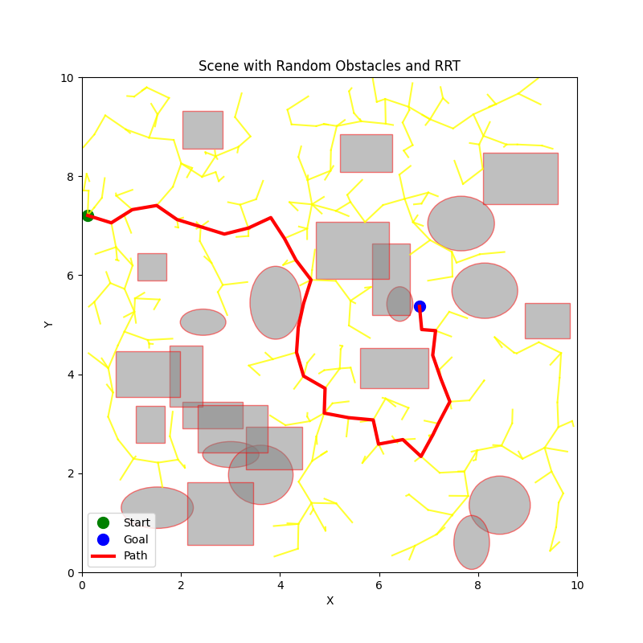
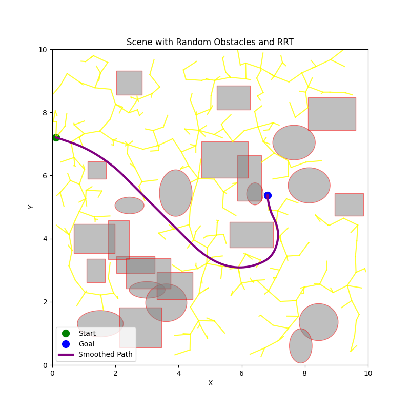
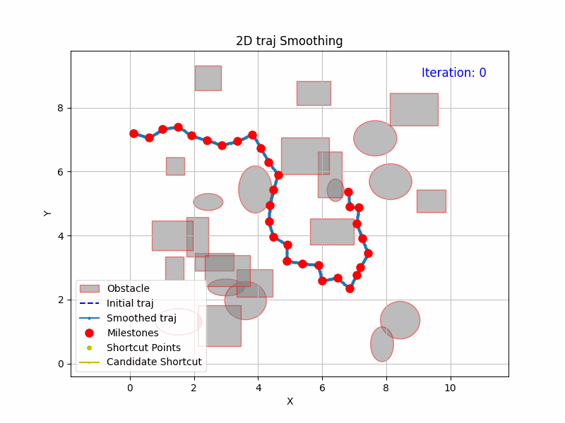

# Bounded-Accel-Traj-Shortcuts

This repository contains a Python implementation of a real-time trajectory smoothing algorithm based on the paper:  
**["Fast Smoothing of Manipulator Trajectories using Optimal Bounded-Acceleration Shortcuts"](https://ieeexplore.ieee.org/document/5509683), ICRA 2010**.  

It efficiently generates shortcut trajectories that satisfy **position, velocity, and acceleration constraints**.

📌 **Note**: This implementation is a **reproduction** of the original paper. You can find the original implementation [here.](https://github.com/krishauser/KrisLibrary/blob/master/planning/ParabolicRamp.cpp)  

---

## ✨ Example: RRT Path vs. Smoothed Path  

The following example illustrates how the trajectory smoothing algorithm refines a raw RRT-generated path.  

| **Original RRT Path** | **Smoothed Path** |
|----------------|----------------|
|  |  |

To better visualize the effect of smoothing, see the GIF below:  

